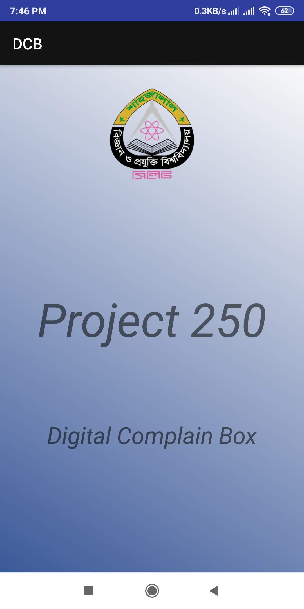
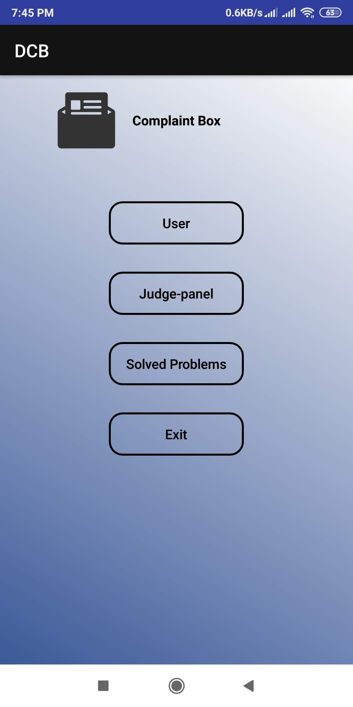
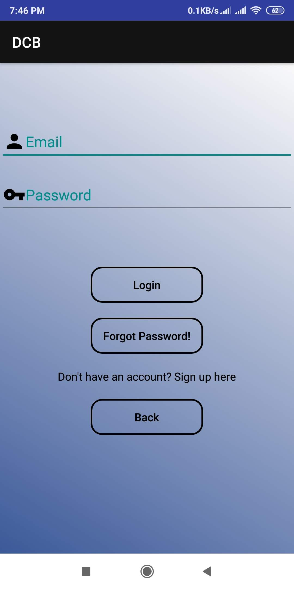
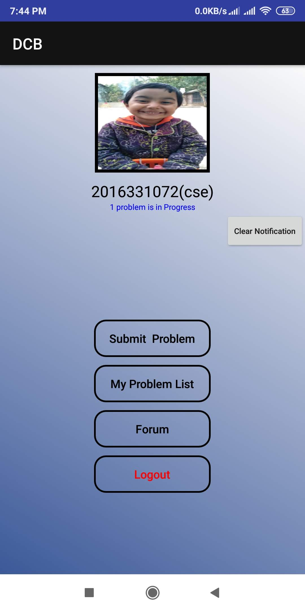
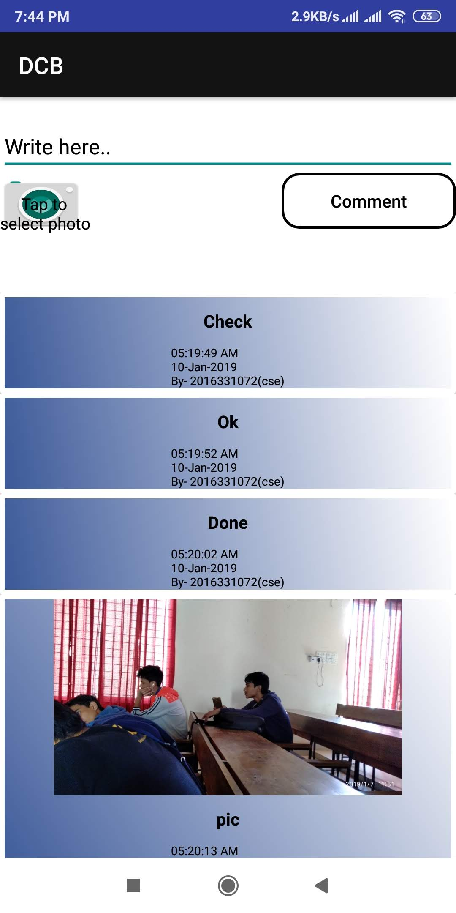
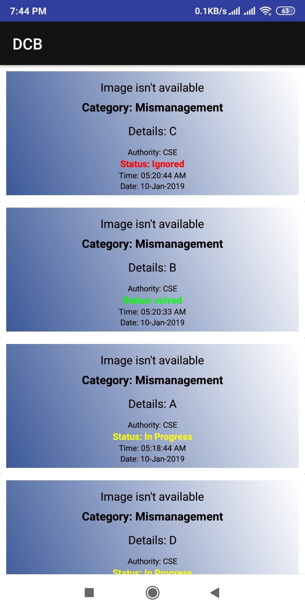
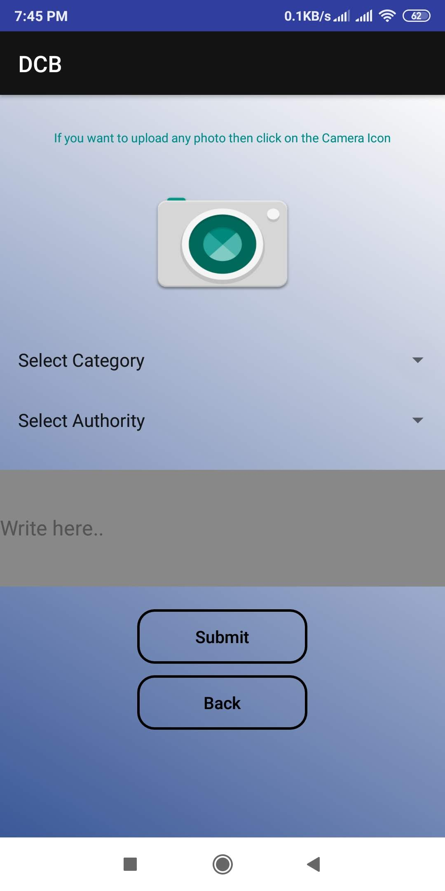
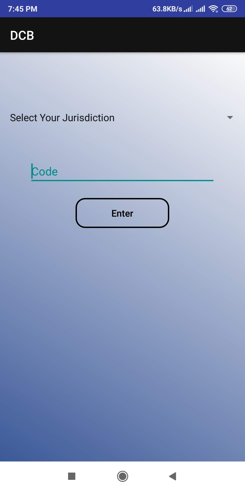
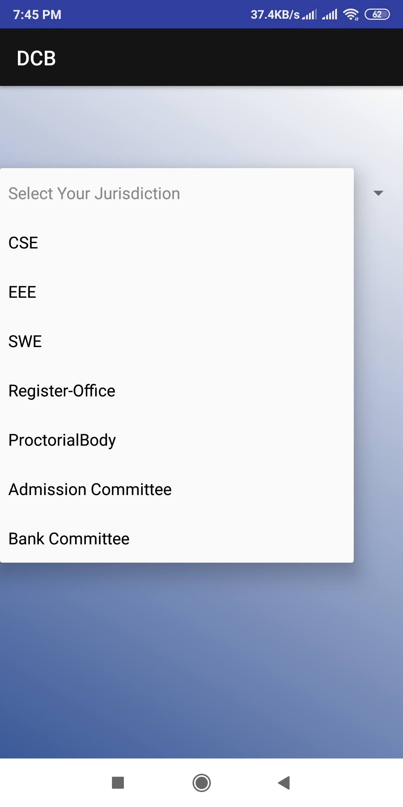
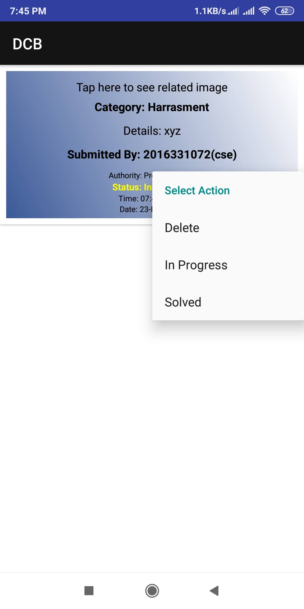

# DigitalComplainBox

 

## Intro
It was developed as a Projectwork for Project 250 (2/2)

## About App
Using this app one can complain about any kind of mismanagement/harrasment etc
directly to respective authorities. Then authorities can take proper steps to resolve 
the problem and can give update about the complaint to the complainant.

To use this - 

normal users have to create account using their email and have to verify their email.

Judges are given passwords for their respective fields to see respective complaints .
Example-password for cse department’s judge is “1”.

**Some SS from DigitalComplainBox:**

 
 
 
 
 
